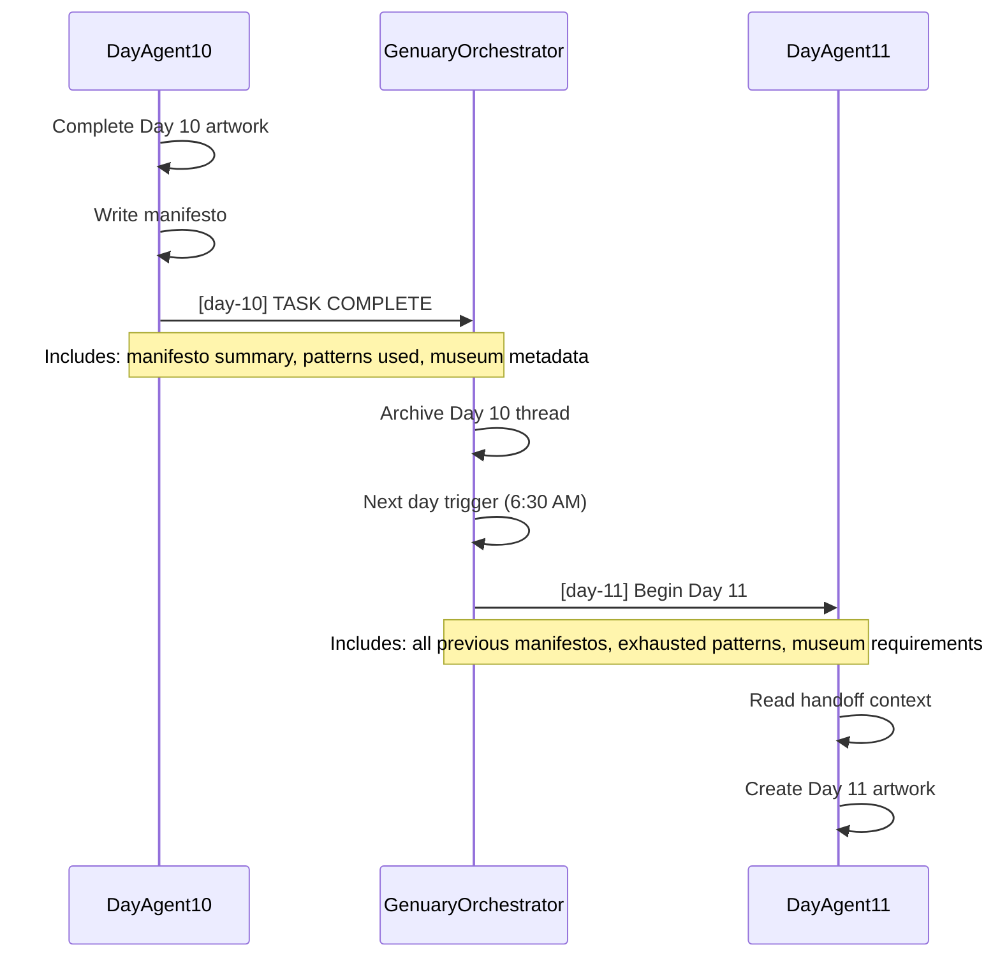

# MCP Agent Mail Adoption Proposal: coding-jams (Genuary 2026)

## Executive Summary

Coding-jams implements a sophisticated three-tier agent architecture for Genuary 2026: Day Agents (31 daily art pieces), Harness Agents (infrastructure), and the Curator Agent (WebXR museum). MCP Agent Mail would enhance this system by providing structured handoffs between sequential Day Agents, file reservations for the shared harness, and coordination for the complex Curator integration.

**Key Benefits:**
- **Sequential Day Agent continuity**: Structured handoff messages preserve artistic context
- **Harness protection**: Reservations prevent Day Agents from conflicting with infrastructure changes
- **Museum integration coordination**: Curator can track all 31 Day Agents' display requirements
- **Manifesto threading**: Artistic evolution documented in message threads

**Recommendation**: High-value adoption due to complex multi-agent coordination. Implement before Genuary 2027.

---

## Proposed Agent Identities

| Agent Identity | Role | Active Period | Description |
|----------------|------|---------------|-------------|
| `DayAgent01`-`DayAgent31` | Daily art creation | Jan 1-31 | One agent per day, sequential activation |
| `HarnessAgent` | Infrastructure | Ongoing | Shared utilities, controls, recording |
| `CuratorAgent` | Museum builder | Jan 28-31 | Integrates all 31 pieces into WebXR museum |
| `GenuaryOrchestrator` | Coordinator | Full month | Manages daily triggers and handoffs |

---

## Message Flow Patterns

### Pattern 1: Day Agent Sequential Handoff



### Pattern 2: Harness Agent Coordination

```
┌─────────────────┐                    ┌──────────────────┐
│  HarnessAgent   │                    │   DayAgent15     │
│                 │                    │                  │
│ Working on      │  file_reservation  │                  │
│ recording.ts    │  paths=["src/      │                  │
│                 │  utils/recording   │                  │
│                 │  .ts"]             │                  │
│                 │  exclusive=true    │                  │
│                 │ ─────────────────► │                  │
│                 │                    │                  │
│                 │                    │ Tries to import  │
│                 │                    │ recording util   │
│                 │                    │                  │
│                 │  send_message      │ BLOCKED          │
│                 │  "Recording API    │                  │
│                 │  changing, use     │                  │
│                 │  new signature"    │                  │
│                 │ ─────────────────► │                  │
│                 │                    │                  │
│ Release         │                    │ Adapt to new     │
│ reservation     │                    │ API              │
└─────────────────┘                    └──────────────────┘
```

### Pattern 3: Curator Integration Requests

```
┌─────────────────────────────────────────────────────────────────┐
│ CuratorAgent collecting museum metadata from all 31 days        │
├─────────────────────────────────────────────────────────────────┤
│                                                                 │
│  CuratorAgent:                                                  │
│    for day in 1..31:                                            │
│      fetch_thread(thread_id=f"day-{day}")                       │
│      extract: museumMetadata, display_type, performance_notes   │
│                                                                 │
│  If metadata incomplete:                                        │
│    send_message(                                                │
│      to_agents=["GenuaryOrchestrator"],                         │
│      subject=f"[museum] Need display specs for Day {day}",      │
│      body="Please update museumMetadata with:\n- display_type"  │
│    )                                                            │
│                                                                 │
│  Compile museum-plan integration:                               │
│    - 6 display types mapped to pieces                           │
│    - 9 emotional zones assigned                                 │
│    - Performance budgets validated                              │
│                                                                 │
└─────────────────────────────────────────────────────────────────┘
```

### Pattern 4: Exhausted Pattern Broadcasting

```
GenuaryOrchestrator maintains exhausted patterns thread:

thread_id: "exhausted-patterns"

Day 1 completes:
  send_message(thread_id="exhausted-patterns", body="Day 1 used: spirals, Perlin noise")

Day 2 completes:
  send_message(thread_id="exhausted-patterns", body="Day 2 used: concentric circles")

...

Day 15 starts:
  fetch_thread(thread_id="exhausted-patterns")
  → Sees all 14 previous patterns
  → MUST choose something different
```

---

## Integration with Current Patterns

### Enhancing /start-day Command

Current flow:
```markdown
1. Read prompts.md for day's prompt
2. Read all previous manifestos
3. Check exhausted patterns in CLAUDE.md
4. Acknowledge constraints
5. Begin implementation
```

Enhanced with Agent Mail:
```markdown
1. register_agent(agent_name=f"DayAgent{N}")
2. fetch_inbox() - Check for orchestrator instructions
3. fetch_thread(thread_id="exhausted-patterns")
4. fetch_thread(thread_id=f"day-{N-1}") - Previous day's handoff
5. file_reservation_paths(paths=[f"src/days/{N:02d}.ts"], exclusive=true)
6. send_message(thread_id=f"day-{N}", subject="Day {N} starting")
7. ... implementation ...
```

### Enhancing /finish-day Command

Current flow:
```markdown
1. Write manifesto to .claude/manifesto/day-N.md
2. Capture PNG/GIF via Playwright
3. Create PR with assets
4. Output TASK COMPLETE
```

Enhanced with Agent Mail:
```markdown
1. Write manifesto
2. Capture assets
3. send_message(
     thread_id=f"day-{N}",
     subject=f"[day-{N}] TASK COMPLETE",
     body="""
     ## Manifesto Summary
     {key artistic insights}

     ## Patterns Used
     {list for exhausted-patterns tracking}

     ## Museum Metadata
     {display_type, performance_notes, spatial_requirements}

     ## PR
     #{pr_number}
     """
   )
4. send_message(thread_id="exhausted-patterns", body=f"Day {N}: {patterns_used}")
5. release_file_reservations()
6. Create PR
```

### Enhancing Curator Ralph Loop

Current:
```bash
# Persistent tmux window, same worktree
# Agent receives continuation prompts
```

Enhanced:
```markdown
CuratorAgent on startup:
1. register_agent(agent_name="CuratorAgent")
2. fetch_all_threads(pattern="day-*")  # All 31 day threads
3. fetch_thread(thread_id="museum-progress")  # Ongoing museum work
4. file_reservation_paths(
     paths=["src/museum/**/*", "src/days/museum-integration.ts"],
     exclusive=true,
     reason="museum-build"
   )

On each iteration:
5. send_message(
     thread_id="museum-progress",
     subject="[museum] Integration update",
     body="Completed zones 1-3, performance at 45 FPS"
   )

On completion:
6. send_message(
     to_agents=["GenuaryOrchestrator"],
     thread_id="museum-progress",
     subject="[museum] TASK COMPLETE",
     body="Museum ready. All 31 pieces integrated. PR #XX"
   )
```

---

## File Reservation Strategy

### Day Agent Reservations

Each Day Agent reserves only its day file:
```
DayAgent05:
  Reserve: ["src/days/05.ts"]
  Reason: "day-05"
  Exclusive: true
  TTL: 86400 (24 hours - full day)
```

### Harness Agent Reservations

Harness reserves infrastructure during changes:
```
HarnessAgent:
  Reserve: [
    "src/harness/*.ts",
    "src/utils/*.ts",
    "src/index.ts"
  ]
  Reason: "harness-improvement-bd-xyz"
  Exclusive: true
  TTL: 7200 (2 hours)
```

**Critical**: Day Agents depend on harness. Harness changes should:
1. Complete and release before 6:30 AM daily trigger
2. Or coordinate with active Day Agent via message

### Curator Agent Reservations

Curator needs broad access during museum build:
```
CuratorAgent:
  Reserve: [
    "src/museum/**/*",
    "src/days/*.ts"  # Reading for integration, not modifying
  ]
  Reason: "museum-build"
  Exclusive: false for days/*.ts (read-only)
  Exclusive: true for museum/**/*
  TTL: 345600 (4 days - Jan 28-31)
```

---

## Thread Organization

| Thread ID | Purpose | Participants |
|-----------|---------|--------------|
| `day-01` through `day-31` | Per-day work and handoff | DayAgentN, Orchestrator, Curator |
| `exhausted-patterns` | Track used techniques | All Day Agents |
| `harness-updates` | Infrastructure changes | HarnessAgent, all Day Agents |
| `museum-progress` | Museum build status | CuratorAgent, Orchestrator |
| `museum-integration` | Per-piece integration notes | CuratorAgent, DayAgents (async) |

---

## Risks and Considerations

### Genuary-Specific Risks

| Risk | Mitigation |
|------|------------|
| Day Agent overlap (timer drift) | 24-hour TTL on file reservations; orchestrator validates previous day complete |
| Harness changes breaking active day | Harness must complete before 6:30 AM trigger; use messages for API changes |
| Curator integration blocking days | Curator uses read-only reservations for `src/days/*.ts` |
| Exhausted patterns divergence | Single authoritative thread; orchestrator validates before day start |
| 31 concurrent thread overhead | Threads are lightweight; archive completed days |

### Operational Complexity

| Aspect | Consideration |
|--------|---------------|
| Systemd + Agent Mail | Ensure server running before daily trigger |
| Long-running Curator | 4-day TTL on reservations; monitor for expiration |
| Manifesto preservation | Git-backed messages complement manifesto files |
| Multi-year support | Thread naming: `day-2026-01`, `day-2027-01` for future years |

---

## Proposed Beads

| Bead | Title | Priority | Domain |
|------|-------|----------|--------|
| `bd-gen-mail-001` | Configure Agent Mail for Genuary project | P2 | harness |
| `bd-gen-mail-002` | Add agent registration to /start-day command | P2 | harness |
| `bd-gen-mail-003` | Implement exhausted-patterns thread protocol | P2 | harness |
| `bd-gen-mail-004` | Add handoff messaging to /finish-day | P2 | harness |
| `bd-gen-mail-005` | Curator thread collection for museum integration | P3 | museum |
| `bd-gen-mail-006` | File reservation strategy for parallel work | P3 | harness |

---

## Implementation Timeline

```
Pre-Genuary (December):
  - Install Agent Mail server
  - Configure for coding-jams project
  - Update /start-day and /finish-day commands
  - Test with sample day workflow

Genuary 2026 (January):
  - Day 1-27: Use enhanced commands with messaging
  - Day 28-31: Curator uses thread collection for integration
  - Post-month: Archive threads, document learnings

Genuary 2027 Preparation:
  - Review thread organization
  - Update year-specific thread naming
  - Apply learnings from 2026
```

---

## Conclusion

MCP Agent Mail is particularly well-suited for coding-jams due to the project's emphasis on:

1. **Sequential handoffs**: Day-to-day continuity is critical for artistic evolution
2. **Institutional memory**: Exhausted patterns and manifestos need structured tracking
3. **Complex integration**: Curator must coordinate 31 independent pieces
4. **Time-sensitive coordination**: Daily triggers require reliable handoff state

The thread-based organization maps naturally to the daily structure, and file reservations prevent the harness/day agent conflicts that could derail time-boxed creative work.

**Unique opportunity**: Genuary 2026's multi-agent creative workflow could become a reference implementation for artistic AI coordination using Agent Mail.
